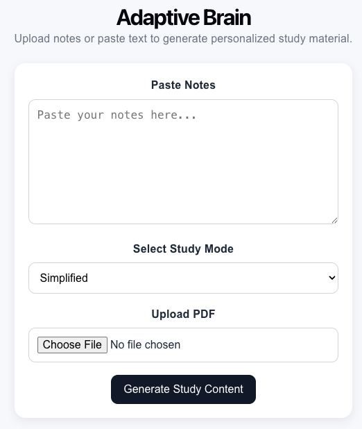
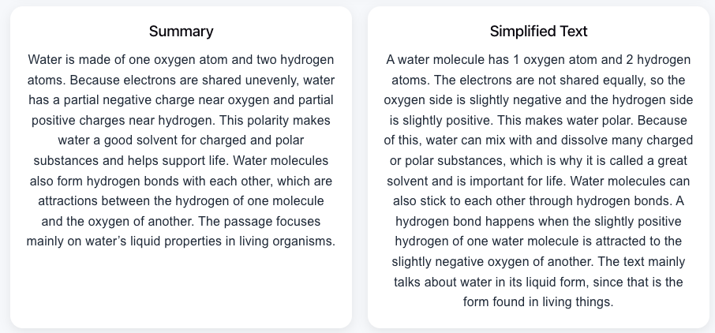
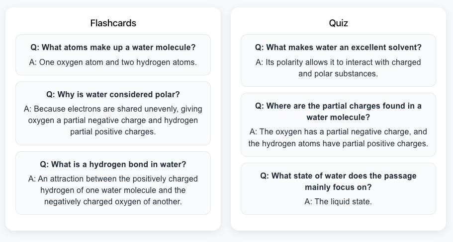

# Adaptive-Brain
Adaptive Brain is an AI-powered study assistant that transforms notes and PDFs into structured learning material — including summaries, flashcards, quizzes, and simplified explanations.

It helps students learn faster by adapting content to different study modes such as simplified learning, focus mode, memory-based learning, and exam preparation.

## Features
- Upload PDFs or paste notes
- AI-powered content generation
  - Summaries
  - Flashcards
  - Quiz questions
  - Simplified explanations
- Personalized study modes
  - Simplified
  - Focus
  - Memory
  - Exam Cram
- Firebase integration
  - Firestore for session storage
  - Cloud Storage for file uploads
- Full-stack architecture (React + FastAPI)

## Tech Stack

### Frontend
- React
- JavaScript
- CSS

### Backend
- FastAPI (Python)
- Firebase Admin SDK
- OpenAI API

### Database & Storage
- Firebase Firestore
- Firebase Cloud Storage

## System Architecture

1. User uploads a PDF or pastes text  
2. Backend creates a study session in Firestore  
3. PDF text is extracted
4. AI generates structured study content  
5. Results are stored in Firestore  
6. Frontend retrieves and displays learning material  

## Setup Instructions

- Clone the repository
- Backend Setup
    - Navigate to ./backend and run `uvicorn app.main:app --reload`
- Frontend Steup
    - Navigate to ./frontend and run `npm install` then `npm run dev`

## Dependencies
- Python/Pip
- Firebase CLI
- npm
Navigate to the backend directory and execute :
- `pip install -r requirements.txt` to install all the requirements for the backend to function

## Demo

